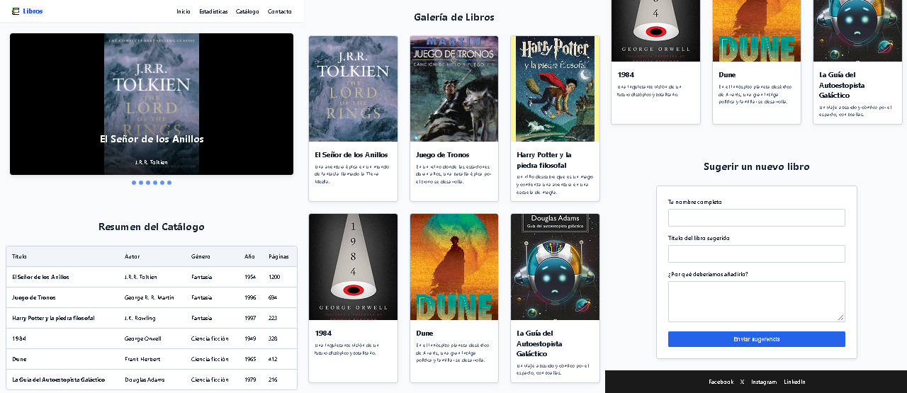

# Sitio Web de Libros

Proyecto web desarrollado utilizando HTML semántico y CSS.

## 📁 Estructura del Proyecto

- `css/`: Contiene el archivo de estilos (`estilos.css`).
- `js/`: Contiene el archivo de funciones (`funciones.js`).
- `images/`: Contiene las imágenes utilizadas en la web.
- `test/`: Carpeta de pruebas (omitida mediante `.gitignore`).
- `index.html`: Archivo principal con todo el contenido semántico.
- `.gitignore`: Archivo para omitir la carpeta `test/`.
- `README.md`: Información del proyecto.

## 🚀 Contenido de la Web

- **Navegación:** Menú principal con enlaces.
- **Carrusel:** Portadas de libros.
- **Tabla:** Información del catálogo de libros.
- **Galería:** Tarjetas con las portadas y descripciones.
- **Formulario:** Sección para que los usuarios sugieran nuevos libros.
- **Footer:** Redes sociales de contacto.

## 🛠️ Tecnologías

- HTML
- CSS
- Git
- GitHub
